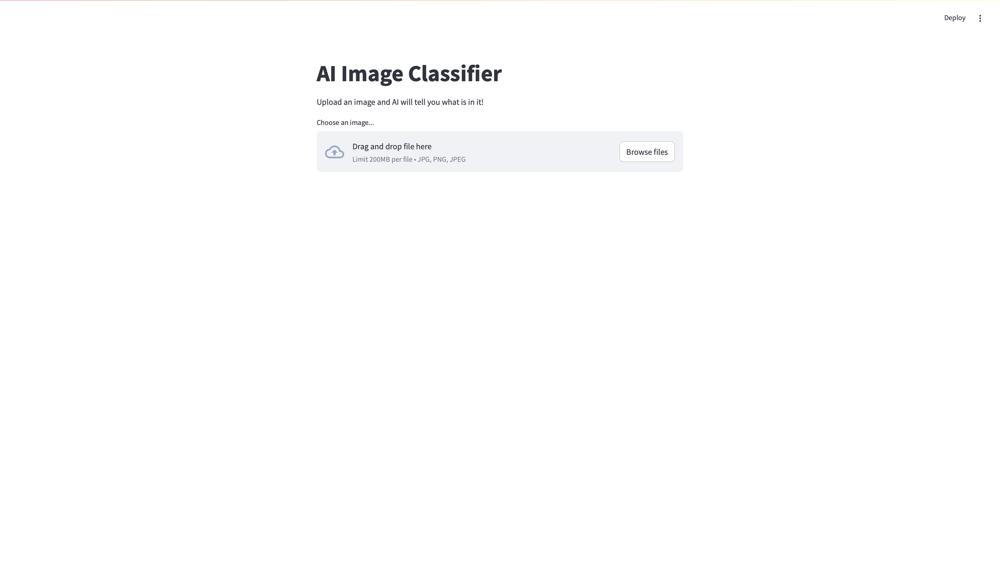
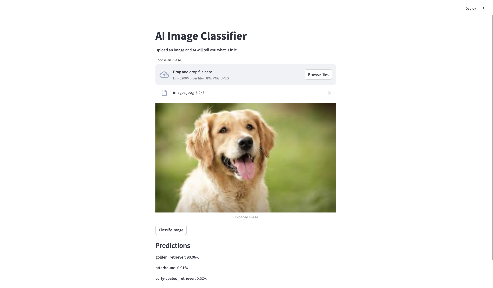

# AI-Image-Classifier
Streamlit web app that uses MobileNetV2 to classify images. Upload a .jpg or .png and get the top-3 predictions with confidence scores.

# 🚀 To Run
pip install streamlit tensorflow opencv-python Pillow
streamlit run main.py

## 🔍 Example Output

Uploaded Image:

